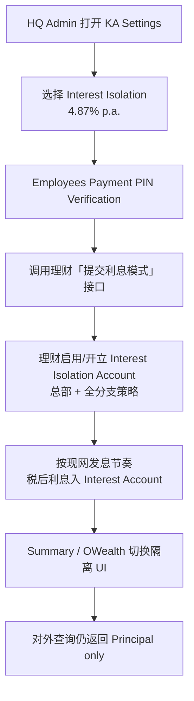
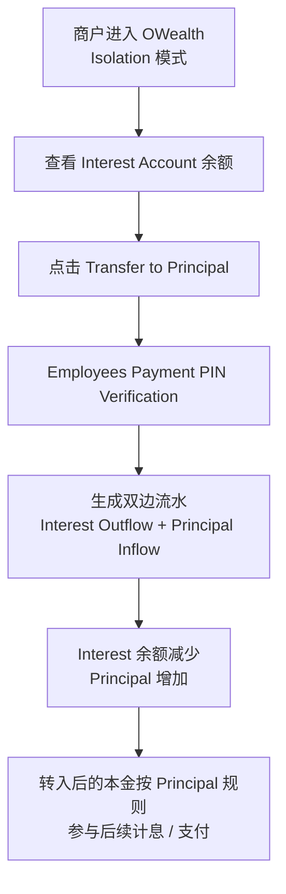
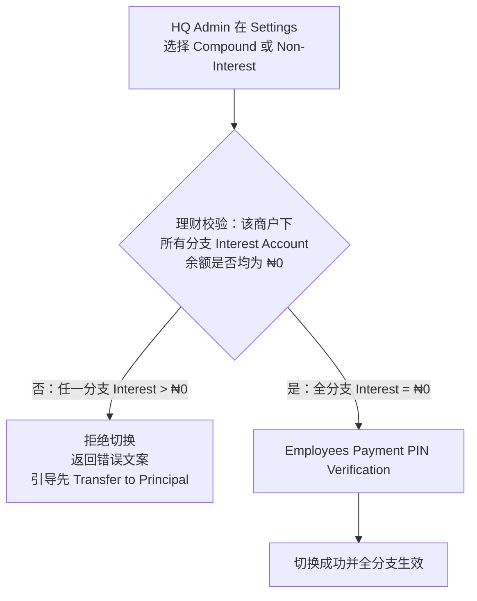
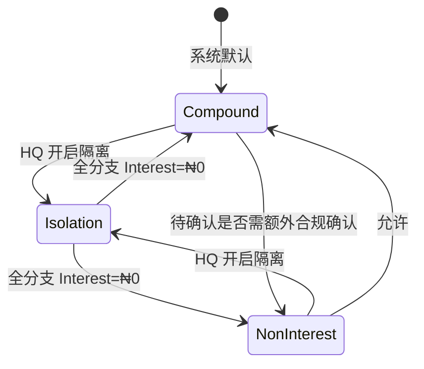

# KA OWealth 本息分离（Interest Separation）需求文档

| 项 | 内容 |
|---|---|
| 关联事实陈述 | [KA OWealth 本息分离业务需求事实陈述](https://kcnjoswqqjwl.feishu.cn/wiki/FIehwDgGiiQUxskV7hkcI8Xjnbb) |
| 计划版本 | 0910（原 0903） |
| 文档类型 | 功能迭代 + 管理后台配置 + 服务端账户能力 |
| DEMO 参考 | `fixed-special-ka-admin-demo`（仅交互示意，非正式交付物） |

---

## 1. 修订记录

| 时间 | 版本号 | 修订人 | 修订内容 |
|------|--------|--------|----------|
| 2026-09-10 | V1.0 | 戴思敏 | 创建。按四块范围（理财前端 / 分账户与对外余额 / 交易与 Statement / KA 设置）整理正式需求稿 |
| 2026-09-10 | V1.1 | 戴思敏 | 第 4 章主流程改为 Mermaid 流程图；补充模式切换状态示意 |

---

## 2. 需求背景

### 2.1 项目背景

当前 KA OWealth 采用**复利**模式：税前年化 **5% p.a.**，日利率为：

\[
r_{daily} = (1 + 5\%)^{1/365} - 1
\]

T 日基于 T-1 日终余额计息，T 日凌晨发放；发放利息在 T+1 日纳入计息本金；发息时扣减 **Withholding Tax 10%**，商户实收税后利息。利息直接并入 OWealth Available Balance，与本金混同。

由此带来的商户痛点：

1. **透明度不足**：大额余额下日利息难以察觉  
2. **信任下降**：本息混同无法核对利息金额  
3. **会计核算困难**：经营资金与投资收益无法分账  
4. **再投资收益归属模糊**：难以区分本金收益与利息再投资收益  

调研结论（事实陈述）：超 **40** 家商户明确提出利息分离需求；TL 预估使用率 **50%–90%**。商户普遍愿以略低利率换隔离，前提是差异透明、可选、可切换。

### 2.2 业务目标

1. 提供可选的 **Interest Isolation（单利隔离）** 模式，使本金与利息分账户核算与展示  
2. 统一 **对外 / 可支付余额 = Principal only**，Interest 不可支付、不再生息  
3. 完成 KA Settings 配置能力、全分支生效与切换校验，保障资金与配置安全  

### 2.3 模式对比（调整前 vs 调整后）

| 维度 | 调整前（现网默认） | 调整后（可选 Isolation） | 备注 |
|------|-------------------|--------------------------|------|
| 计息方式 | Compound | Simple（非复利） | Isolation 为可选，非强制 |
| 税前年化 | 5% p.a. | **4.87% p.a.** | 差额约 **13 bps**，因放弃利息再投资，**非降息口径** |
| 日利率 | \((1+5\%)^{1/365}-1\) | \(4.87\% / 365\) | 见 5.2 |
| 利息入账 | 并入 OWealth 本金 | 入 **Interest Isolation Account** | 不再生息 |
| 对外可用余额 | OWealth 合计（本息混同） | **仅 Principal** | 交易可用同口径 |
| 利息使用 | 已在本金内可支付 | 需 **Transfer to Principal** 后使用 | 文案见 5.1 |
| 非利息模式 | 已有合规诉求 | 保留 **Non-Interest** | 与 Isolation 切换受余额校验约束 |

> 重要说明：Isolation 与 Non-Interest 为独立配置项；除本文已定义的「Interest 全分支余额须为 0 方可退出 Isolation」外，二者更深互斥关系 **待确认**。

---

## 3. 需求范围

| 需求 | 简要说明 |
|------|----------|
| 【H5】Savings Summary 模式化展示 | Compound / Isolation / Non-Interest 下 Total Assets 与利息区展示差异 |
| 【H5】OWealth 资产卡与 Detail | 单卡/双卡、双 Tab 流水、分账户导出 csv/pdf、Transfer to Principal |
| 【理财核心】Interest Isolation Account | 开启隔离后开立产品侧内部利息账户；发息入隔离户 |
| 【理财核心】对外余额口径 | 对外 OWealth / 可支付余额仅 Principal；内部接口可返回本息拆分 |
| 【理财核心】交易类型与双边记账 | 新增 Interest Transfer to Principal；流水分账户 |
| 【服务端】Statement 分账户生成 | Principal / Interest 分别出 CSV、PDF |
| 【KA】Interest Setting 配置页 | KA 前端改造 Settings；三选一模式 + PIN |
| 【服务端】设置查询/提交与校验 | 全分支 Interest 余额校验；失败返回明确错误码与文案 |
| 【Native】SuperBapp OWealth | 本息分离展示与双 Tab **待确认是否同版本** |

---

## 4. 业务流程图 / 用例设计

> 本章流程图统一使用 **Mermaid**。若飞书导入后未自动渲染，可在飞书文档中插入「代码块 / 流程图」或粘贴至支持 Mermaid 的预览工具查看。

### 4.1 主流程：开启 Interest Isolation



**变化要点：**

- 设置页由 **KA 前端**承接，理财 DEMO Settings 仅示意  
- 成功后配置为**商户级全局生效**（总部 + 全部分支）  
- 发息路径从「入本金」变为「入 Interest Account」  

### 4.2 主流程：Interest → Principal



### 4.3 主流程：退出 Isolation / 切换 Non-Interest 或 Compound



**变化要点：**

- 校验是**全局**的：任一分支 Interest > ₦0 即整次失败  
- 禁止服务端在切换时「静默把 Interest 并入 Principal」绕过商户确认（除非产品另行确认自动合并方案；**本期默认禁止**）  

### 4.4 模式切换关系（示意）



### 4.5 用例一览

| 用例 | 角色 | 前置 | 结果 |
|------|------|------|------|
| UC-01 开启 Isolation | HQ Admin | 当前为 Compound/Non-Interest | 全分支按隔离发息与展示 |
| UC-02 Transfer to Principal | 有权限操作资金的商户用户 | Interest > ₦0 | 双边记账，Interest 减少 |
| UC-03 切回 Compound | HQ Admin | 全分支 Interest = ₦0 | 恢复复利 5% p.a. |
| UC-04 切换 Non-Interest | HQ Admin | 全分支 Interest = ₦0 | 停止计息 |
| UC-05 有余额时强制切换 | HQ Admin | 任一支分支 Interest > ₦0 | 失败并提示 |

---

## 5. 需求详细说明

### 5.1 【H5】Savings Summary

#### 5.1.1 页面结构

| 区域 | Compound | Interest Isolation | Non-Interest |
|------|----------|--------------------|--------------|
| Total Assets 主卡 | 展示 | 展示 | **通栏展示** |
| 底部拆分文案 | `OWealth` + `Fixed` | `OWealth: {total} (Principal {p}, Interest {i})` + `Fixed` | `OWealth` + `Fixed`（无本息括号拆分） |
| Yesterday's Interest 卡 | 展示 | 展示 | **隐藏** |
| Total Interest Earned 卡 | 展示 | 展示 | **隐藏** |
| Interest Trend | 展示 | 展示 | **隐藏** |

#### 5.1.2 文案（英文）

| 元素 | 文案 |
|------|------|
| 主标题 | `Total Assets (Saving)` |
| Compound 底部 | `OWealth:` / `Fixed:` |
| Isolation 底部 | `OWealth: ₦ {shortTotal} (Principal {shortP}, Interest {shortI})` ；右侧 `Fixed:` |
| 短金额 | 使用 K/M 缩写展示，如 `₦ 5.2M`、`₦ 687.3K`（与现网 Summary 短金额规则一致；精确规则 **待确认**是否统一 1 位小数） |

金额全量展示格式：`₦ 8,540,230.50`。

---

### 5.2 【H5】OWealth

#### 5.2.1 资产区状态差异

| 元素 | Compound | Interest Isolation | Non-Interest |
|------|----------|--------------------|--------------|
| 左侧主卡 | 单卡 OWealth | Principal（约 2/3）+ Interest（约 1/3），等高 | 单卡 OWealth **通栏** |
| 利率 Tag | `5% p.a.` | Principal：`4.87% p.a.`；Interest：无利率 Tag | `Interest Disabled` |
| 右侧 Yesterday / Total Interest | 展示 | 展示 | **隐藏** |
| Auto-deposit 引导 | 展示 | 展示 | **隐藏** |
| Deposit / Withdraw | 有 | 仅 Principal | 有 |
| Transfer to Principal | 无 | Interest 卡底部按钮 | 无 |

#### 5.2.2 Interest Account 规则

| 规则 | 说明 |
|------|------|
| 支付 | **不可支付** |
| 计息 | **不再生息** |
| 使用路径 | 仅支持转入 Principal |
| 说明文案 | `Not payable / not interest-bearing. Transfer to Principal before use.` |

#### 5.2.3 交互与文案

| 操作 | 文案 / 行为 |
|------|-------------|
| 主按钮 | `Deposit` / `Withdraw` / `Transfer to Principal` |
| Transfer 禁用 | Interest = ₦0 或处理中时 disabled |
| 敏感操作 | Deposit / Withdraw / Transfer 提交前弹出 PIN（见 5.5） |

弹窗（余额不足等沿用现网；本期新增拦截见第 6 章）：

```
标题：Employees Payment PIN Verification
正文区域标签：Employees Payment PIN *
输入框占位：Numbers only
链接：Forgot Employees Payment PIN
按钮：[Cancel] [Confirm]
```

#### 5.2.4 Detail / Statement（隔离模式）

| 项 | 说明 |
|----|------|
| Tab | `Principal Account` / `Interest Account` |
| 列表字段 | Transaction Date / Transaction Type / Balance Before(₦) / Inflow(₦) / Outflow(₦) / Balance After(₦) |
| 下载 | 跟随**当前 Tab**：`csv` / `pdf` |
| PDF/CSV 标题 | `Transaction Statements - Principal Account` 或 `Transaction Statements - Interest Account` |
| 非隔离 | 单账户 OWealth；标题 `Transaction Statements - OWealth`（或与现网标题对齐，**待确认**） |

Account Summary 字段（对齐现网）：Branch Name、Opening Balance、Closing Balance、Inflow/Outflow Count、Money In/Out（或 Total Inflows/Outflows）、File ID、Issuing Date 等。

免责声明（现网口径）：

`*OWealth related services are powered by OPay MicroFinance Bank, which is fully licensed by the CBN and insured by the NDIC.`

---

### 5.3 【理财核心】账户、发息与对外余额

#### 5.3.1 账户模型

| ID | 规则 |
|----|------|
| A1 | 开启 Interest Isolation 后开立 **Interest Isolation Account**（OWealth **产品侧内部账户**） |
| A2 | Account Core **本期暂不**新开独立实体账户 |
| A3 | 首次开户或首次开启隔离时完成账户准备；未就绪不得按隔离规则发息 |
| A4 | Interest：不纳入计息本金、不参与支付、不再生息 |

#### 5.3.2 计息公式

**Compound（保持现网）：**

\[
r_{c} = (1 + 5\%)^{1/365} - 1,\quad
Interest_{gross} = Principal_{T-1} \times r_{c}
\]

税后入本金（WHT = 10%）：

\[
Interest_{net} = Interest_{gross} \times (1 - 10\%)
\]

（WHT 计提时点/展示是否与现网完全一致：**待确认**财务口径。）

**Interest Isolation：**

\[
r_{s} = \frac{4.87\%}{365},\quad
Interest_{gross} = Principal_{T-1} \times r_{s},\quad
Interest_{net}\ 入\ Interest\ Isolation\ Account
\]

**Non-Interest：** 不产生新利息。

#### 5.3.3 对外余额口径（关键）

| 场景 | 返回值 |
|------|--------|
| 对外「OWealth 余额」 | **Principal only** |
| 交易可用 / 可支付 OWealth 额度 | **Principal only** |
| 理财内部 Summary/OWealth 展示 | 可返回 Principal、Interest、合计 |

---

### 5.4 【理财核心】【服务端】交易与 Statement

#### 5.4.1 交易类型

| 类型 | 账户 | 说明 |
|------|------|------|
| Interest | Interest（隔离）/ Principal 或 OWealth（复利） | 日发息 |
| Deposit | Principal / OWealth | 存入 |
| Payment Withdraw | Principal / OWealth | 取出 |
| **Interest Transfer to Principal** | 双边 | Interest Outflow + Principal Inflow |

Transfer 每笔必须记录：Balance Before / Amount / Balance After（两侧各自完整）。

#### 5.4.2 查询与导出

| 能力 | 要求 |
|------|------|
| 列表 | 按账户维度查询 Principal / Interest |
| CSV | 分账户导出 |
| PDF | 分账户导出；版式对齐现网 Statement（File ID、Issuing Date、Summary、Details、Disclaimer） |

---

### 5.5 【KA】【服务端】Interest Setting

> **协作：** 设置 UI 由 **KA 前端团队**改造；理财提供查询/提交接口与校验。理财侧 DEMO 不替代正式 KA 页。

#### 5.5.1 配置项

| 选项 | 展示要点 |
|------|----------|
| Compound Interest (Default) | `5% p.a. (pre-tax)`；Recommended |
| Interest Isolation (Simple Interest) | `4.87% p.a. (pre-tax)`；说明放弃再投资导致利率差 |
| Non-Interest Mode | 不计息；合规客群 |

权限：仅 **Headquarter Admin** 可改；Branch Admin 不可改。

#### 5.5.2 接口能力（逻辑）

| 接口 | 行为 |
|------|------|
| 查询当前模式 | 返回商户当前利息模式 |
| 提交切换 | 成功则总部+**全部支分支**同时生效 |

#### 5.5.3 切换校验（P0）

当目标模式为 **Compound** 或 **Non-Interest** 时：

1. 汇总校验该商户下**所有分支机构** Interest Account 余额  
2. 任一分支余额 \(> ₦0\) → **整次拒绝**  
3. 全部为 ₦0 → 允许进入 PIN → 切换  

**失败提示文案（建议，英文对客 / 中文对内）：**

```
标题：（KA 可用 Toast 或 Dialog，结构二选一，待与 KA 现网设置错误样式对齐）
正文：Interest Account still has a balance (including branch accounts). Please transfer Interest to Principal on OWealth for all related accounts before switching to Compound or Non-Interest mode.
按钮：[Got it]
```

对内说明：`存在未结转的利息隔离余额（含分支机构）。请先在 OWealth 将各账户 Interest 转入 Principal 后再切换付息模式。`

#### 5.5.4 模式切换矩阵

| 当前 \ 目标 | Compound | Isolation | Non-Interest |
|-------------|----------|-----------|--------------|
| Compound | — | 允许 | 允许（规则 **待确认**是否需额外合规确认） |
| Isolation | 全分支 Interest=0 才允许 | — | 全分支 Interest=0 才允许 |
| Non-Interest | 允许 | 允许 | — |

---

### 5.6 PIN 校验（跨端约定）

设置提交、Transfer to Principal（以及资金存取，若现网同类操作已要求 PIN）须走：

**Employees Payment PIN Verification**（文案见 5.2.3）。  
校验失败/取消：不落库、不改配置、不记账。

---

## 6. 异常与特殊边界

### 6.1 配置与账户异常

| 场景 | 处理 |
|------|------|
| Isolation 账户未开立成功 | 切换失败或进入只读降级；**不得**按隔离发息；错误码待定 |
| 提交切换时部分分支校验超时 | 整单失败，保持原模式；提示重试 |
| 有 Interest 余额时切 Compound/Non-Interest | 拒绝 + 5.5.3 文案 |
| 并发 Transfer 与切换 | 以服务端余额校验为准；切换前再次读余额 |

### 6.2 客户账户 / 交易异常

| 场景 | 处理 |
|------|------|
| Interest = ₦0 点 Transfer | 按钮禁用；若绕过接口返回业务错误 |
| Transfer 金额 ≠ 全部余额 | 本期默认 **全额转移**（若支持部分转移：**待确认**） |
| PIN 取消 | 关闭弹窗，无副作用 |
| 对外接口误返回 Principal+Interest | 视为缺陷；验收必须覆盖 |

### 6.3 展示降级

| 场景 | 处理 |
|------|------|
| 内部拆分字段缺失 | Summary/OWealth 不展示错误合计；Interest 区显示 `--` 或隐藏并上报 |
| Statement 无数据 | 仍出文件头 + Account Summary + 空表明文案 `No transactions in this range.` |

---

## 7. 埋点需求

> 以下为建议草案，事件名与参数以数据同学终审为准；未确认项标待确认。

| 修订日期 | 应用名称 | 标记 | 页面名称 | 事件名称 | 触发条件 | 事件类型 | 埋点参数 |
|----------|----------|------|----------|----------|----------|----------|----------|
| 2026-09-10 | KA Admin | KA PC | Interest Setting | `ka_interest_setting_page_view` | 进入设置页 | 页面浏览 | `merchant_id`; `current_mode` |
| 2026-09-10 | KA Admin | KA PC | Interest Setting | `ka_interest_setting_submit_click` | 点击 Submit | 点击 | `merchant_id`; `target_mode` |
| 2026-09-10 | KA Admin | KA PC | Interest Setting | `ka_interest_setting_submit_result` | 提交返回 | 结果 | `merchant_id`; `target_mode`; `result`(`success`/`fail`); `fail_reason` |
| 2026-09-10 | KA Admin | KA PC | OWealth | `ka_owealth_transfer_to_principal_click` | 点击 Transfer to Principal | 点击 | `merchant_id`; `branch_id`; `interest_balance` |
| 2026-09-10 | KA Admin | KA PC | OWealth | `ka_owealth_transfer_to_principal_result` | 转移结果 | 结果 | `merchant_id`; `branch_id`; `amount`; `result` |
| 2026-09-10 | KA Admin | KA PC | OWealth Detail | `ka_owealth_statement_download_click` | 点击 csv/pdf | 点击 | `account_type`(`principal`/`interest`/`owealth`); `format`(`csv`/`pdf`) |
| 待确认 | SuperBapp | NATIVE / 端内 H5 | OWealth | 待确认 | 待确认 | 待确认 | 待确认 |

---

## 8. 灰度上线策略

| 项 | 说明 |
|----|------|
| 放量 | 待确认（建议：先内测商户 → 小流量 HQ → 全量） |
| 观察指标 | Isolation 开启率、Transfer 成功率、切换失败率（余额拦截占比）、对外余额口径客诉、发息金额对账 |
| 回滚 | 关闭新开 Isolation 入口；已隔离商户处理策略 **待确认** |
| 依赖 | KA Settings 页与理财接口、账户开立需同版本或按依赖顺序发布 |

---

## 9. 附件

| 附件 | 说明 |
|------|------|
| 事实陈述 | [KA OWealth 本息分离业务需求事实陈述](https://kcnjoswqqjwl.feishu.cn/wiki/FIehwDgGiiQUxskV7hkcI8Xjnbb) |
| DEMO | `fixed-special-ka-admin-demo`（UI/流程示意） |
| 设计稿 | 待补充 |
| 接口文档 | 待补充（查询/提交模式、余额拆分、Transfer、Statement） |
| FAQ | 待补充（利率差解释口径、全分支校验说明） |

---

## 待确认清单（汇总）

| # | 事项 | 建议责任方 |
|---|------|------------|
| 1 | Non-Interest 与 Isolation / Compound 切换是否需额外合规确认 | 产品 + 合规 |
| 2 | Isolation 下 WHT 计提/展示与对账明细 | 产品 + 财务税务 |
| 3 | 历史利息是否追溯拆分 | 产品 + 数据/研发 |
| 4 | Transfer 后本金计息生效日（T+0 / T+1） | 产品 + 研发 |
| 5 | 是否支持部分金额 Transfer | 产品 |
| 6 | SuperBapp 是否纳入 0910 同版本 | 产品 + 移动端 |
| 7 | Statement 非隔离标题是否与现网完全一致 | 产品 + 前端 |
| 8 | Summary 短金额 K/M 小数位规则 | 产品 + 前端 |
| 9 | 灰度比例与已隔离商户回滚策略 | 产品 + 研发 |
| 10 | Interest 是否允许不经 Principal 直接提到 Balance | 产品 |
